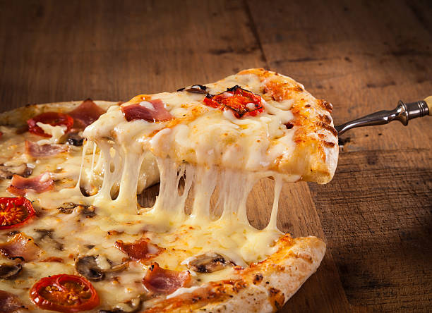

# PIZZA SALES ANALYSIS - 2015

## Introduction

I often wonder if am the only one who finds pizza simply irresistible.Its a go to when you need an easy meal at home or even for an office event.My favorites remains the BBQ Chicken Pizza and the Pepperoni Pizza.I was looking for a dataset to get my hands dirty with and i came across this dataset from Quantum Analytics and for the love of Pizza i jump on it and i found it rich with insights.

*__Disclaimer__* : _All datasets and reports do not represent any company,institution, or country but just a dummy dataset to demonstrate the capabilities of PowerBI._
#### PowerBI Concepts Applied:
DAX, Calculated Columns, Quick Measures, Slicers.

## Problem Statement

The Stakeholders have requested the following Insights on the dashboard:
- Total Revenue
- Total Orders
- Number of Pizza Category
- Total Quantity
- Revenue by Category
- Best selling Pizza (Top 5)
- Revenue trend by Day of the Week
- Orders and Quantities by Day of the week
- Quantity sold by Pizza size
- Time of the day with highest Sales.

## Data Sourcing

After effectively communicating with the Stakeholders to clearly understand their reporting requirements and expectations i went ahead to source for the data internally.I then downloaded the excel file studied it properly to understand the dataset before extracting in to PowerBI for Cleaning, Modelling, Analysis and Visualization.

The downloaded Excel file is a structured data and made up of 4 tables (Sheets) as follows:

Table 1. ORDERS - With 21,351 rows and 4 Columns.

Table 2. PIZZA PRICE - With 97 rows and 4 Columns.

Table 3. ORDER DETAILS - With 48,621 rows and 4 Columns.

Table 4. PIZZA TYPES - With 33 rows and 4 Columns.

## Data Transformation/Cleaning :

The four tables were then loaded on Power Query editor of POWERBI where Table 2-4 were merged (Join) into Table one using the Primary and Foreign keys for the join and only Table one loaded on POWERBI  .see screen shot below:

Also to clean and transform the data after merging some of the applied steps taken included;

- Promoting first row as header in the ORDER Table.
- Amending the header name for Price as Unit Price.
- Created a custom column for "Actual Price" using custom column formular Actual Price = [Unit price]*[quantity]
- Data Type was changed from decimal to whole numbers.
- Created a new measure to calculate the Total revenue,Total Order and Total Quantity sold using the below DAX Formular; - 

  TOTAL REVENUE = SUM(Orders[Actual Price])
  
  TOTAL ORDER   = COUNT(Orders[order_id])
  
  TOTAL QTY SOLD= SUM(Orders[quantity])
 - Transform date in a new column to "Name of days" and also "days of week"
 - Created a new column with the time column provided using the DAX formular - Time Of The Day = IF(Orders[time] < 12, "MORNING", "AFTERNOON")
 - Created a new column to show the various time of the day using DAX. See syntax below;
  
  
  
 - Close and apply steps.

## Data Modelling

Since i already merged the tables into a single table fom the start there was no data modelling to be done.

## Data Analysis and Visuals

The report consist of 3 pages. 

You can interact with the report [here](https://app.powerbi.com/groups/me/reports/a477f852-cba1-4eca-bbc4-fc7adfeb5bbc/ReportSection)

From the Analysis conducted the following insights were gotten
1. The Total Revenue for the year 2015 was £815k
2. The Pizza company makes 32 varieties of Pizza which is divided into 4 category 
3. For the year 2015 they sold a Total Quantity of 50,000 (50K) from the Total of 49,000 order made.
4. The Revenue analysis shows an upward trend during the weekdays and a downward trend during the weekends with peak of sale on Fridays.This explains the most profitable days for the pizza company which is likely because it is located in a busy enviroment surrounded by Working professionals and Students.See screenshots below.

5. The Large size Pizza had the highest sale which is 38% of the total sales that was made for the year 2015 and was closely followed by the Medium size at 32%.
6. A proper analysis shows the Thai Chicken Pizza as the top Pizza making a total revenue of £44k, While the BBQ chicken Pizza,California Chicken,Classic Deluxe and South WestChicken Pizza were the top 5 pizza.see Screenshot below;

7. The total quantity sold by time of the day indicates that the pizza company recorded more sales in the afternoon when compared with the morning ,and also the evening.See Screenshots below.This analysis would help the stakeholder decide when more manpower is needed in order to serve the customers appropriately.

## Conclusion

- In the year 2015 the company recorded more sales on weekdays and a drop in sales on weekends.
- They made more sales in the afternoon than the morning time.
- And made more income from the Thai Chicken pizza.
- The Brie Chicken Pizza,Green Garden,Spinach Supreme,Meditarenean,and the Spinanch presto were the least selling Pizza.

## Recommendations

For a deep dive into the analytics, the datasets of the previous years will be required for comparison and data driven decision making.
However using the data for the  year 2015 provided the following recommendations can be made.
- Consider running promotions or discounts during weekends to attract more customers and increase sales.
- Consider introducing a new variation of the  Thai Chicken Pizza such as the Thai Chicken and Mushroom Pizza.
- Explore delivery services during the afternoon to expand its reach and increase sales.
- consider giving discounts for the bottom 5 to increase sales.

## Limitations to analysis

1. The data provided covered only one year.
2. The demography of the customers were not considered in the analysis.This would help to determine why the XXL had a lower sales.
3. The location was also not provided.

